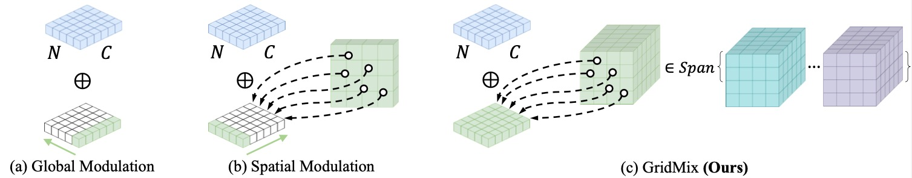

# GridMix
This repo contains the official PyTorch code for GridMix (ICLR 2025, **Oral**).

+ [GridMix: Exploring Spatial Modulation for Neural Fields in PDE Modeling](https://openreview.net/forum?id=Fur0DtynPX&referrer=%5BAuthor%20Console%5D(%2Fgroup%3Fid%3DICLR.cc%2F2025%2FConference%2FAuthors%23your-submissions))

## Overview

GridMix is a novel approach that improves spatial modulation in neural fields by leveraging a mixture of grid-based representations. Existing methods rely on global modulation, which limits local detail reconstruction, while vanilla grid-based approaches struggle with overfitting and inadequate global information modeling. GridMix addresses these challenges by balancing global structure exploration with fine-grained locality preservation.

To further enhance robustness, we introduce spatial domain augmentation, improving generalization across varying spatial domains. GridMix serves as a key component of MARBLE, a comprehensive framework advancing PDE modeling with neural fields. Our method is extensively validated on benchmarks in dynamics modeling and geometric prediction, demonstrating significant improvements.

<p align="center">
    
</p>

## Installation
Clone the repo and install the dependencies.
```
git clone https://github.com/LeapLabTHU/GridMix.git
cd GridMix
conda create -n marble python=3.9.0
pip install -e .
pip install torch_geometric
pip install pyg_lib torch_scatter torch_sparse torch_cluster torch_spline_conv -f https://data.pyg.org/whl/torch-2.0.0+cu117.html
```

Setup wandb config in `~/.bashrc`
```
export WANDB_API_TOKEN=your_key
export WANDB_DIR=your_dir
export WANDB_CACHE_DIR=your_cache_dir
export WANDB_CONFIG_DIR="${WANDB_DIR}config/wandb"
export MINICONDA_PATH=your_anaconda_path
```

## Data preparation 
* Dynamics Modeling: NS and SW data can be generated using [DINo](https://github.com/mkirchmeyer/DINo) repo. We provide the generated data in [google drive](https://drive.google.com/drive/folders/1R9UlelzGbjMzU8v--LivQE_WJe02ppMU?usp=sharing).
* Geometric-aware inference: NACA-Euler, Elasticity and pipe data can be downloaded from [google drive](https://drive.google.com/drive/folders/1YBuaoTdOSr_qzaow-G-iwvbUI7fiUzu8), which is provided by [Geo-FNO](https://github.com/neuraloperator/Geo-FNO.git) repo.


## Training 
For dynamics modeling, we provide the training scripts in `repro_dynamics`. Taking the navier-stokes data as an example, the two-step training process is as follows:
```
# train the inr model
bash ./repro_dynamics/navier-stokes/marble_ns_s1_bash.sh

# train the dynamics model
bash ./repro_dynamics/navier-stokes/marble_ns_s1_ode_bash.sh
```

For geometric-aware inference, we provide the training scripts in `repro_static`. Taking the elasticity data as an example, the training process is as follows:
```
# train the inr model with global modulation for input functions
bash ./repro_static/elasticity/coral_inr_bash.sh

# train the inr model with gridmix modulation for output functions
bash ./repro_static/elasticity/marble_inr_bash.sh

# train the regression model
bash ./repro_static/elasticity/marble_regression_bash.sh
```

## Acknowledgement
This code is developed on the top of [CORAL](https://github.com/LouisSerrano/coral.git), we thank to their efficient and neat codebase.

## Citation 
If you find our work is useful in your research, please consider citing:

```
@inproceedings{wanggridmix,
  title={GridMix: Exploring Spatial Modulation for Neural Fields in PDE Modeling},
  author={Wang, Honghui and Song, Shiji and Huang, Gao},
  booktitle={The Thirteenth International Conference on Learning Representations},
  year={2025},
}
```
## Contact
If you have any questions, please feel free to contact us at wanghh20@mails.tsinghua.edu.cn.